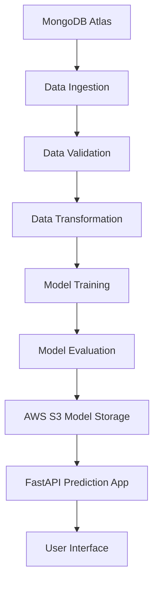
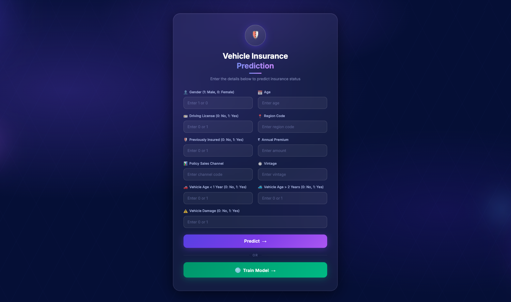

# Vehicle Insurance Prediction

[](#)
[](#)
[](#)
[](#)
[](#)
[](#)


An end-to-end vehicle insurance prediction project built with FastAPI, scikit-learn, MongoDB Atlas, and AWS. The application predicts whether a customer is likely to respond to a vehicle insurance offer and exposes the prediction through a simple web interface.

This project was designed to demonstrate more than just model training. It shows a full workflow that includes data ingestion, validation, transformation, training, evaluation, model publishing to AWS S3, and a web app that loads the deployed model for inference.

## Table Of Contents

- Overview
- Features
- Business Problem
- Architecture
- Tech Stack
- Project Structure
- Setup
- Environment Variables
- Running The Project
- API Endpoints
- Screenshots
- AWS Deployment Notes
- Author

## Overview

The goal of this project is to predict the `Response` variable for a vehicle insurance marketing dataset:

- `1` means the customer is likely to respond positively
- `0` means the customer is unlikely to respond

The pipeline is organized in a modular way so each stage can be maintained and improved independently. The trained model is stored in AWS S3, and the web app loads the latest approved model from there for prediction.

## Features

- End-to-end machine learning pipeline
- MongoDB Atlas integration for data ingestion
- Data validation through a YAML schema
- Feature transformation and imbalance handling
- Model training using scikit-learn
- Model evaluation against the previously deployed version
- Model push to AWS S3
- FastAPI web app for live predictions
- Training trigger from the web interface
- Clean, responsive HTML/CSS interface

## Business Problem

Insurance companies often want to identify which customers are more likely to respond to a vehicle insurance offer. A model like this helps prioritize outreach, reduce wasted marketing effort, and focus on customers with higher conversion potential.

This project can be presented as:

- a customer response prediction use case
- a production-style ML workflow
- a cloud-backed deployment project

## Architecture



## Tech Stack

- Python 3.12
- FastAPI
- Uvicorn
- Jinja2
- pandas
- numpy
- scikit-learn
- imbalanced-learn
- PyYAML
- MongoDB Atlas
- AWS S3
- AWS EC2
- AWS ECR
- boto3

## Project Structure

```text
Vehicle-Insurance-Project/
├── app.py
├── demo.py
├── config/
│   ├── model.yaml
│   └── schema.yaml
├── notebook/
│   ├── data.csv
│   ├── exp-notebook.ipynb
│   └── MongoDB_demo.ipynb
├── src/
│   ├── cloud_storage/
│   ├── components/
│   ├── configuration/
│   ├── constants/
│   ├── data_access/
│   ├── entity/
│   ├── exception/
│   ├── logger/
│   ├── pipline/
│   └── utils/
├── static/
├── templates/
├── requirements.txt
├── pyproject.toml
├── setup.py
└── Dockerfile
```

## Setup

### 1. Clone the repository

```bash
git clone <your-repo-url>
cd Vehicle-Insurance-Project
```

### 2. Create a virtual environment

```bash
python -m venv venv
```

Activate it:

```bash
source venv/bin/activate
```

On Windows:

```bash
venv\Scripts\activate
```

### 3. Install dependencies

```bash
pip install -r requirements.txt
```

## Environment Variables

The project expects these environment variables:

```bash
export MONGODB_URL="your_mongodb_connection_string"
export AWS_ACCESS_KEY_ID="your_aws_access_key"
export AWS_SECRET_ACCESS_KEY="your_aws_secret_key"
```

If you are running on AWS infrastructure with an IAM role, the AWS credentials may already be available through the instance role instead of manual environment variables.

## Running The Project

### 1. Run the training pipeline

This ingests data, validates it, transforms it, trains the model, evaluates it, and pushes the approved model to S3.

```bash
python demo.py
```

### 2. Start the FastAPI app

```bash
python app.py
```

Or run with Uvicorn directly:

```bash
uvicorn app:app --host 0.0.0.0 --port 8000
```

Open the app in your browser:

```text
http://127.0.0.1:8000
```

## API Endpoints

### `GET /`

Renders the HTML prediction form.

### `POST /`

Accepts form input and returns the prediction result on the same page.

### `POST /train`

Runs the full training pipeline and reloads the model in memory.

### `GET /health`

Returns the model status and whether the predictor is ready.

Example response:

```json
{
  "status": "ok",
  "model_ready": true,
  "model_loaded": true,
  "error": null
}
```

## Screenshots

The screenshots and demo video used in this README live in the `screenshots/` folder at the project root.

### Home Page



### Prediction Result


### Training Run


### Model Health


### CI/CD Test Evidence


### Demo Video

The short demo video is available here:

<a href="screenshots/samplevideo.mp4">
  
</a>

Direct video link:

- [samplevideo.mp4](screenshots/samplevideo.mp4)

If you rename or replace any of these files later, update the paths above to match the new names.

## AWS Deployment Notes

This project was deployed with AWS ECR and EC2.

Useful deployment details:

- The model artifacts are stored in AWS S3
- The container image is stored in AWS ECR
- The app is run on an EC2 instance and exposed through its public address
- The FastAPI app listens on port `8000`

If you are shutting down the project to avoid charges, make sure to clean up:

1. The EC2 instance
2. Any attached EBS volumes that you no longer need
3. Any Elastic IPs that were allocated
4. The ECR repository if you do not want image storage charges
5. Any extra AWS resources such as load balancers, NAT gateways, or log groups


## Why This Project Is Good For Hiring Review

This project demonstrates:

- practical machine learning implementation
- modular software design
- working with cloud storage and deployment
- API development with FastAPI
- integration between ML and a real web application
- awareness of production concerns like model versioning and cleanup

## Author

**Dhanush Pavan**
