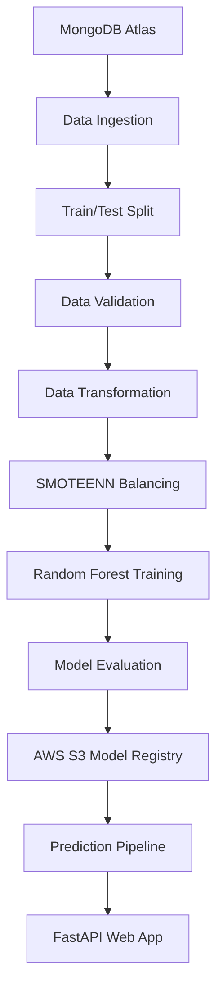

# Vehicle Insurance Prediction

[](#)
[](#)
[](#)
[](#)
[](#)
[](#)

An end-to-end MLOps-style machine learning project that predicts whether a customer is likely to respond to a vehicle insurance offer.

The core pipeline is already functional across ingestion, validation, transformation, training, evaluation, model pushing, and FastAPI-based prediction. The project is in a strong in-progress state, with the remaining work focused on production hardening such as Dockerization, testing, deployment, and cleanup.

## Highlights

- End-to-end training pipeline from MongoDB to S3
- Modular component-based project structure
- Imbalance handling with `SMOTEENN`
- Random Forest model training with threshold tuning
- Model comparison against the current production model
- FastAPI app with HTML prediction interface
- Timestamped artifacts and logs for each run

## Project Status

| Area | Status |
|---|---|
| Data ingestion | Done |
| Data validation | Done |
| Data transformation | Done |
| Model training | Done |
| Model evaluation | Done |
| Model pushing to S3 | Done |
| FastAPI prediction app | Done |
| Docker support | Pending |
| Automated tests | Pending |
| CI/CD | Pending |
| Deployment hardening | Pending |

## Problem Statement

Insurance companies often run cross-sell campaigns to identify customers who are more likely to purchase vehicle insurance. This project predicts the target variable `Response`:

- `1` means the customer is likely interested
- `0` means the customer is unlikely interested

The goal is to make this prediction available through a reproducible ML workflow and a usable prediction app.

## Architecture



## Pipeline Flow

1. **Data Ingestion**
   - Fetches records from MongoDB Atlas
   - Exports the dataset into the local feature store
   - Splits data into train and test sets

2. **Data Validation**
   - Validates dataset structure using `config/schema.yaml`
   - Stores validation reports under `artifact/`

3. **Data Transformation**
   - Maps `Gender`
   - Creates dummy variables for categorical columns
   - Renames engineered features
   - Scales selected columns
   - Handles target imbalance using `SMOTEENN`

4. **Model Training**
   - Trains a `RandomForestClassifier`
   - Searches for a better prediction threshold using F1 score

5. **Model Evaluation**
   - Loads the existing production model from S3
   - Compares the new model against the current one
   - Accepts the new model only if it performs better

6. **Model Pusher**
   - Uploads the accepted model to AWS S3

7. **Prediction Pipeline**
   - Loads the production model from S3
   - Serves inference through the FastAPI app

## Tech Stack

- Python
- FastAPI
- scikit-learn
- imbalanced-learn
- pandas
- numpy
- MongoDB Atlas
- AWS S3
- Jinja2
- Uvicorn

## Project Structure

```text
Vehicle-Insurance-Project/
├── app.py
├── demo.py
├── config/
│   ├── model.yaml
│   └── schema.yaml
├── notebook/
│   ├── data.csv
│   ├── exp-notebook.ipynb
│   └── MongoDB_demo.ipynb
├── src/
│   ├── cloud_storage/
│   ├── components/
│   ├── configuration/
│   ├── constants/
│   ├── data_access/
│   ├── entity/
│   ├── exception/
│   ├── logger/
│   ├── pipline/
│   └── utils/
├── static/
├── templates/
├── artifact/
├── logs/
├── requirements.txt
├── pyproject.toml
└── setup.py
```

## Dataset Overview

The sample dataset is available locally in `notebook/data.csv`.

| Metric | Value |
|---|---|
| Rows | `381,110` |
| Columns | `12` |
| Target | `Response` |
| Negative class | `334,399` |
| Positive class | `46,710` |

This class imbalance is one of the reasons the transformation pipeline uses `SMOTEENN`.

Main features include:

- `Gender`
- `Age`
- `Driving_License`
- `Region_Code`
- `Previously_Insured`
- `Vehicle_Age`
- `Vehicle_Damage`
- `Annual_Premium`
- `Policy_Sales_Channel`
- `Vintage`

## Quick Start

### 1. Clone the repository

```bash
git clone <your-repo-url>
cd Vehicle-Insurance-Project
```

### 2. Create and activate a virtual environment

```bash
python -m venv venv
source venv/bin/activate
```

On Windows:

```bash
venv\Scripts\activate
```

### 3. Install dependencies

```bash
pip install -r requirements.txt
```

## Required Environment Variables

Set the following environment variables before training or prediction.

### MongoDB

```bash
export MONGODB_URL="your_mongodb_connection_string"
```

### AWS

```bash
export AWS_ACCESS_KEY_ID="your_aws_access_key"
export AWS_SECRET_ACCESS_KEY="your_aws_secret_key"
```

## Running the Project

### Run the training pipeline

```bash
python demo.py
```

This pipeline:

- ingests data from MongoDB
- validates the schema
- transforms features
- trains a model
- compares it with the production model
- pushes the accepted model to S3

### Run the FastAPI app

```bash
python app.py
```

Or with reload:

```bash
uvicorn app:app --reload
```

Then open:

```text
http://127.0.0.1:8000
```

## App Preview

### Current UI

The prediction interface is already integrated and visually polished.

### Screenshots

Add screenshots here when you are ready:

- Home page
- Prediction result page
- Training trigger page or logs snapshot

## Web App Notes

The current form is developer-friendly rather than end-user-friendly. It expects mostly model-ready encoded inputs such as:

- `Gender`: `1` for Male, `0` for Female
- `Previously_Insured`: `1` or `0`
- `Vehicle_Age_lt_1_Year`: `1` or `0`
- `Vehicle_Age_gt_2_Years`: `1` or `0`
- `Vehicle_Damage_Yes`: `1` or `0`

A friendlier UI layer with raw categorical selections is still a planned improvement.

## Artifacts and Logs

Each training run creates timestamped outputs inside:

- `artifact/`
- `logs/`

Generated outputs include:

- train and test CSV files
- transformed NumPy arrays
- preprocessing object
- trained model object
- validation report
- execution logs

## Current Gaps

The project works, but a few important pieces are still incomplete:

- `Dockerfile` is currently a placeholder
- `config/model.yaml` is empty
- automated tests are not yet added
- naming and structural consistency still need cleanup
- deployment and CI/CD are not finalized

## Roadmap

1. Add Docker support
2. Add tests for pipeline and API behavior
3. Improve the input UX of the prediction form
4. Add deployment instructions
5. Add screenshots and architecture visuals
6. Clean up naming inconsistencies in the codebase

## Why This Project Matters

This project goes beyond training a model in a notebook. It shows how to move a machine learning use case toward a more realistic delivery workflow with:

- reproducible training
- modular pipeline design
- production model comparison
- cloud-backed model storage
- API-based inference
- a usable frontend layer

## Author

**Dhanush Pavan**

The ML pipeline is already in a solid place. The next phase is mostly about production readiness, cleanup, and packaging the work more professionally.
